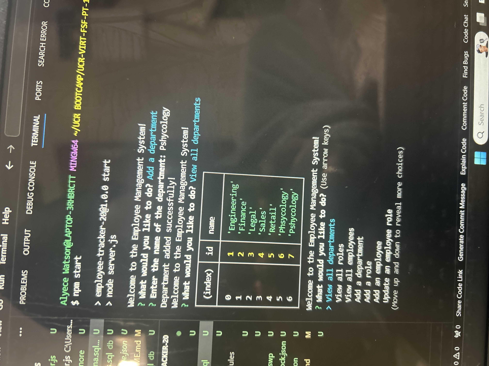

# employee-tracker-20

## Summary 
Employee Tracker is a CLI applicaiton for building and maintaining companies employee data base. Built on MySQL and leveraging modularity in the structure of Employee Tracker, it can scale appropriatley with a companies growth without reconfiguring the core structure of the internal employee data base. This application can act as a foundation to continue to build upon. Employee allows managers or someone within the company to view all employees, roles, as well as departments. It also allows for adding employees, roles, departments and updating employees all from your CLI.

## Demo
Video Link: https://app.screencast.com/azn4NhgCfHgu2?tab=Details&conversation=jcKzeOZMOhFCdxtWIUCG9G

## Getting Started

### Instructions:
In order to use this application you will need to first run an npm install in your CLI to install the dependencies that have been loaded into the json files for you. Once this is done, run node app.js in your CLI to start the prompts that will walk you through the verious tasks you can perform with this application. 

 
## Technologies Used
- MySQL: SQL – Structured Query Language, used in this applicationt to store and query employee and company data. 
- Express.js -  Express is used for application set up of middle ware for end point connection between the front end and backend.
- Node.js - Node is used for package managment and to execute JavaScript code to build command line tool for server-side scripting.
- Javascript - Js is ssed to base functionality of functions and prompts within the application.
- GitHub - Github is used to hosts repository that can be deployed to GitHub Pages
 
## Code Snippet
The following code snippet shows the schema that is the base for our link between our app.js file that operates the functions for building upon our employee tracker, and data base we create with this same schema setup in our sql workbench. Once these two are connected for calling upon our required mysql package and connection port and host thats configured in our JavaScript, We can then execute the functionality of the application through our JavaScript.

```sql
DROP DATABASE IF EXISTS employee_tracker_db;

CREATE DATABASE employee_tracker_db;

USE employee_tracker_db;

CREATE TABLE department (
    id INT NOT NULL PRIMARY KEY AUTO_INCREMENT,
    name VARCHAR(30) NOT NULL
);

CREATE TABLE roles (
    id INT NOT NULL PRIMARY KEY AUTO_INCREMENT,
    title VARCHAR(30) NOT NULL,
    salary DECIMAL(10, 2) NOT NULL,
    department_id INT,
    FOREIGN KEY (department_id)
    REFERENCES department(id)
    ON DELETE SET NULL
);

CREATE TABLE employees (
    id INT NOT NULL PRIMARY KEY AUTO_INCREMENT,
    first_name VARCHAR(30) NOT NULL,
    last_name VARCHAR(30) NOT NULL,
    role_id INT,
    FOREIGN KEY (role_id)
    REFERENCES roles(id)
    ON DELETE SET NULL,
    manager_id INT,
    FOREIGN KEY (manager_id)
    REFERENCES employees(id)
    ON DELETE SET NULL
);

```
## Image (Add Department)
 
 
## Built With
* [MySQL](https://www.mysql.com/)
* [Express.js](https://expressjs.com/)
* [Node.js](https://nodejs.org/en/)
* [inquirer](https://www.npmjs.com/package/inquirer)

## Authors

**Alyece Watson**
- [Link to Github](Watsonaj0316)
